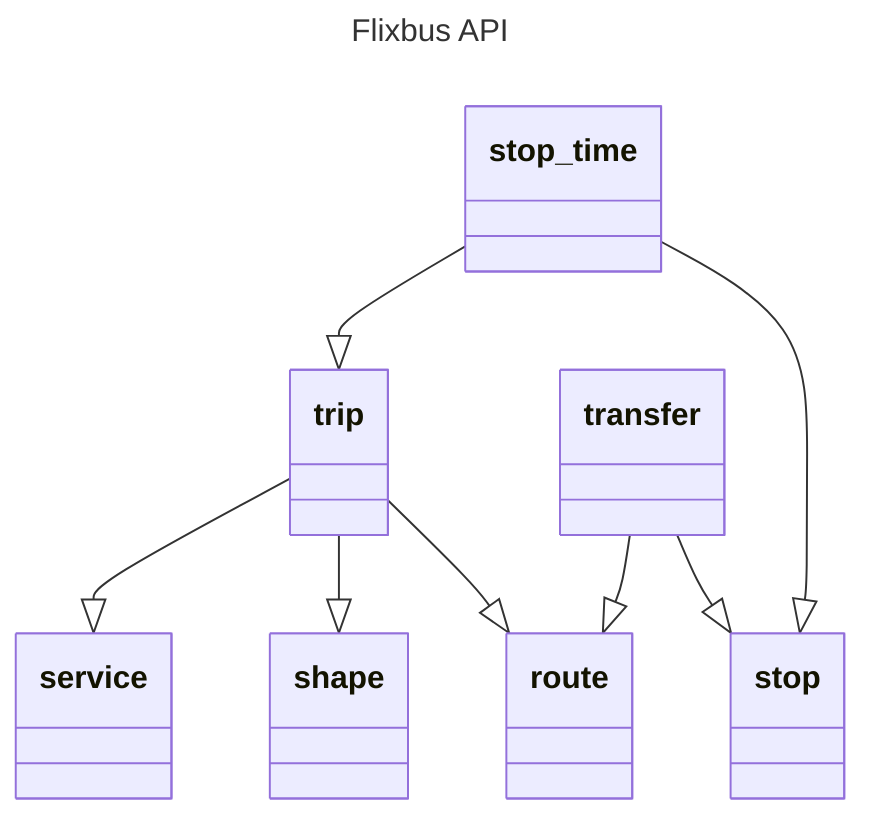

# chronobuses

All direct long-distance buses connections from a given city.
Inspired by **[direkt.bahn.guru](https://github.com/juliuste/direkt.bahn.guru)**

## GTFS
[GTFS](https://gtfs.org) is a community-driven open standard for rider-facing transit information.

> The General Transit Feed Specification, also known as GTFS, is a standardized data format that provides a structure for public transit agencies to describe the details of their services such as schedules, stops, fares, etc. GTFS consists of two main parts: [GTFS Schedule](https://gtfs.org/documentation/schedule/reference) and [GTFS Realtime](https://gtfs.org/documentation/realtime/reference). GTFS Schedule contains information about routes, schedules, fares, and geographic transit details among many other features, and it is presented in simple text files.

For this project, we use the GTFS European schedules of [Flixbus](https://transport.data.gouv.fr/datasets/flixbus-horaires-theoriques-du-reseau-europeen-1) and [BlaBlaBus](https://transport.data.gouv.fr/datasets/blablacar-bus-horaires-theoriques-et-temps-reel-du-reseau-europeen).

According to the GTFS, these following files are defined :

| File Name    | Presence | Description |
| -------- | ------- | ------- |
| stops.txt  | Conditionally Required | Stops where vehicles pick up or drop off riders. Also defines stations and station entrances.  Conditionally Required:  Optional if demand-responsive zones are defined in locations.geojson.  Required otherwise. |
| routes.txt | Required | Transit routes. A route is a group of trips that are displayed to riders as a single service. |
| trips.txt  | Required | Trips for each route. A trip is a sequence of two or more stops that occur during a specific time period. |
| stop_times.txt | Required | Times that a vehicle arrives at and departs from stops for each trip.  | Required | Trips for each route. A trip is a sequence of two or more stops that occur during a specific time period. |
| shapes.txt | Optional | Rules for mapping vehicle travel paths, sometimes referred to as route alignments. |

## stops.json and trips.json
In this project, we want to merge these files in two files : `stops.json` and `trips.json`.

### stops.json
This file contains an array of "stops" data, with the following attributes :
- "stop_id"
- "trips_ids" : an array of all trips ids passing by the given stop.
- "stop_name"
- "stop_lat"
- "stop_lon"

Example : 
| stop_id	| trips_ids	| stop_name	| stop_lat| stop_lon |
| -------- | ------- | ------- | ------- | ------- |
| AAM	| 3967818235,5821457554, ... ,9268981399	| Amarante| 41.26606 | -8.072211 |
| AAX	| 7118270166,9062131284	| Parma Station	| 44.81099 | 10.327835 |

### trips.json
This file contains an array of "trips" data, with the following attributes :
- "route_id"
- "trip_id"
- "route_long_name"
- "route_color"
- "stops_ids" : an array of all stops ids of the given trip route.
- "shape"

Example : 

| route_id | trip_id | route_long_name	| route_color	| stops_ids	| shape |
| -------- | ------- | ------- | ------- | ------- | ------- |
| 6975636	| 2860853229 | Bordeaux City Centre > Toulouse > Perpignan > Le Perthus - France > Le Perthus - Espagne > Barcelona Nord - Bus Station | f25455 | ZFQ,XTS,PGF,XBC | [[44.82272,-0.554691],[43.6133,1.452226],[42.69493,2.879244],[41.394966,2.183275]] |
| 7748027	| 2111206754	| Amsterdam City Center - Sloterdijk > Antwerp > Brussels City Center - Midi Train station > Luxembourg > Metz > Basel > Zürich > Lugano > Milan | f25455	|XAM,XAN,ZYR,LUX,XMZ,SEL,ZRC,LUG,XLM	| [[52.389725,4.838442],[51.219257,4.417153],[50.834965,4.333064],[49.599983,6.105255],[49.110634,6.183319],[47.5461,7.589041],[47.38119,8.537474],[46.023148,8.963815],[45.48977,9.127595]] |

## Flixbus

Here are the scripts used to build the `stops.json` and `trips.json` files :

### BlaBlaBus

